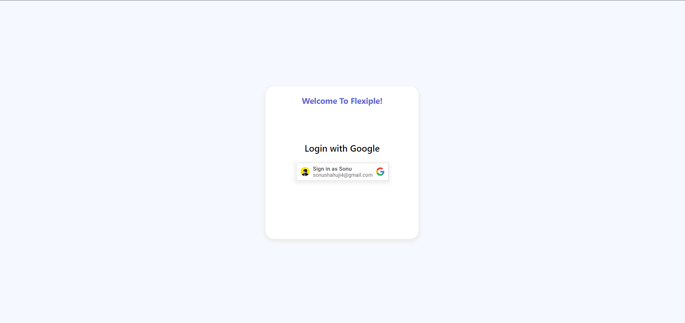
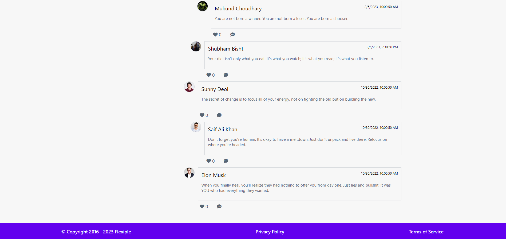
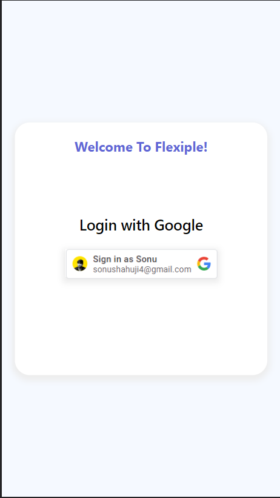
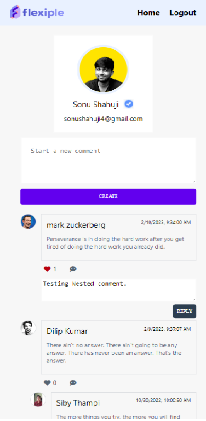
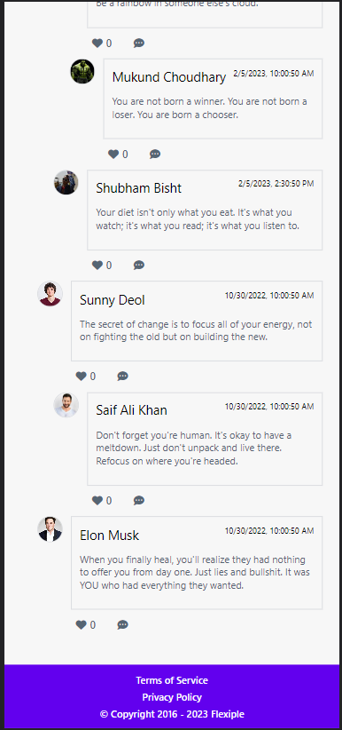

  

<h3 align="center">Comment System Application</h3>

---

   
   
  
  
  

---

  It's a simple front-end comment system, where a user can login using google login and then redirected to home page where user can see all the comments and reply or like a particular comments.
User can even create his or her comment and can modify, delete, reply or like comments.
Once you is done with the application then user can logout and move to login page again.
      

# DEMO
  ### Click Here To Play With The Application. 
  [Flxiple - Comment System](https://dashing-kataifi-0f176d.netlify.app/)

## 🏁 Getting Started 
These instructions will get you a copy of the project up and running on your local machine for development 
and testing purposes.

## ⛏️ Built With 
- [ReactJS](https://reactjs.org/) - Library
- [Hooks](https://reactjs.org/docs/hooks-intro.html) - Hooks

# To Run The Application On Local Machine.
## Clone The Project In Your Local Machine.

- [Click Here To Clone](https://github.com/sonushahuji4/Comment-System-Frontend/tree/master)

# Execute Following Command
### `npm run start`

Open [http://localhost:3000](http://localhost:3000) to view it in the browser.

---
# Features:

    ❖ Login : (Login With Google) 
        • Users needs to login using google account. 
        • Once user is logged in then user will be redirected to home page.

    ❖ Home Page :   
        • Home Page has two section
            • Profile Page
                • Once user is logged in then user will be able to see his or her
                    • Profile Picture
                    • Name 
                    • Email
            • Create Comment
                • User can start a comment by clicking on "Create" button.
            • View Comments   
                • All the comments will be loaded by date wise sorted order.
            • CRUD Operation:
                • Read : User can read comment of other user's.
                • Like : User can like other user's comment or can like his or her comment as well.
                • Reply : User can reply to other user's comment and comment can be nested and there is no limit.
                • Update : User can only update his or her comments and will not be able to modify other user's comment.
                • Delete : User can only delete his or her comments and will not beable to delete other user's comment.
    ❖ Footer Page :
        • Footer Section will have some details like copy right, privacy policy etc.

    ❖ Logout Page :
        • Once user is done with the application and then user can logout and user will be redirected to login page, where user can login again.

# Screenshots For Desktop 

- Login Page

- Home Page

- Footer Page

---

# Screenshots For Mobile 

### Login Page

### Home Page

### Footer Page

---

## ✍️ Authors 
- [@Sonu Shahuji](https://github.com/sonushahuji4) - Flexiple - Comment System

## 🎉 Acknowledgments 
- References
- [Flexiple](https://hrishikeshp.notion.site/Software-Engineer-Task-4f4b75bcbd5d48eb9dd205bd4c3d5f85)